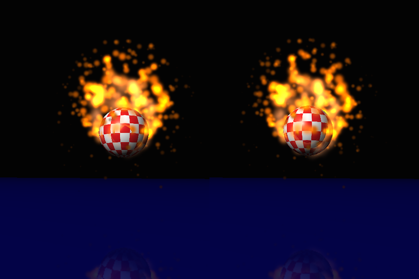

# VR-iOS-Experiment

A simple Virtual Reality proof-of-concept app written in Swift for iOS 8.
SceneKit is used to generate a scene containing a bouncing 
[Boing Ball](https://en.wikipedia.org/wiki/Amiga) with a flame particle
effect. Two `SCNView` views are used to create a stereoscopic view of the
scene. Core Motion is used to track the user's head movements as they look
around.  



You'll need some kind of head-mount (maybe 
[Google Cardboard](http://en.wikipedia.org/wiki/Google_Cardboard) or
a [Stooksy VR-Spektiv](http://www.stooksy.com/)?)
or a pair of [loupes](https://en.wikipedia.org/wiki/Loupe), and, obviously,
an [iPhone](https://www.apple.com/iphone-6/).
 
### License

**VR-iOS-Experiment Copyright © 2014 Steven Saunders**

```
This program is free software: you can redistribute it and/or modify
it under the terms of the GNU General Public License as published by
the Free Software Foundation, either version 3 of the License, or
(at your option) any later version.

This program is distributed in the hope that it will be useful,
but WITHOUT ANY WARRANTY; without even the implied warranty of
MERCHANTABILITY or FITNESS FOR A PARTICULAR PURPOSE.  See the
GNU General Public License for more details.

You should have received a copy of the GNU General Public License
along with this program.  If not, see <http://www.gnu.org/licenses/>.
```
 
